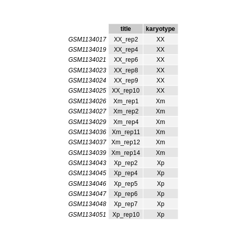
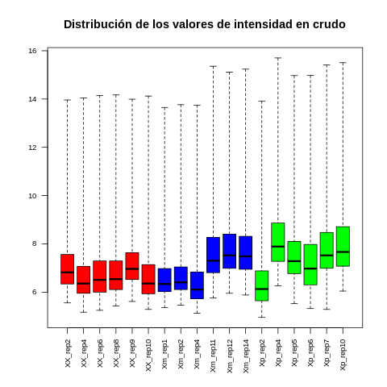
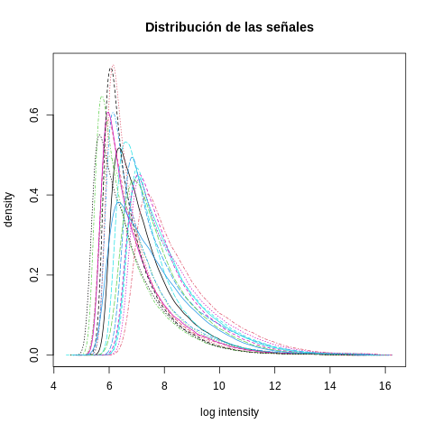
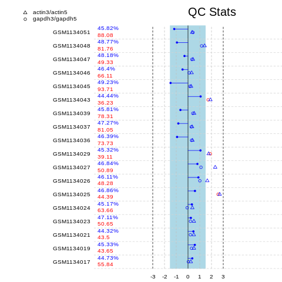
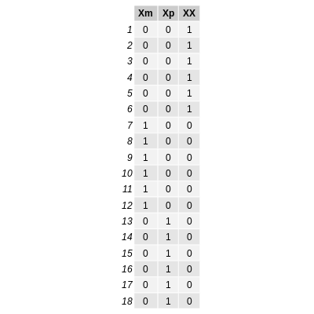
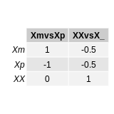
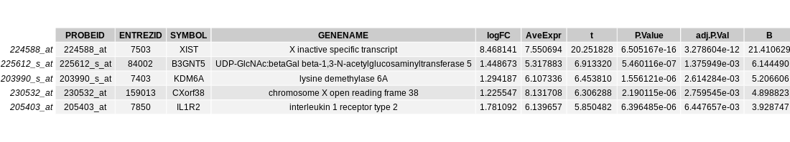
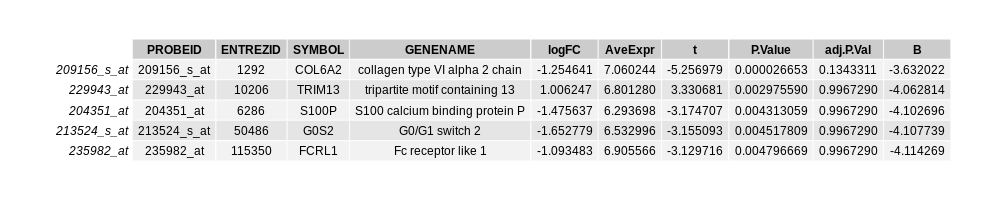
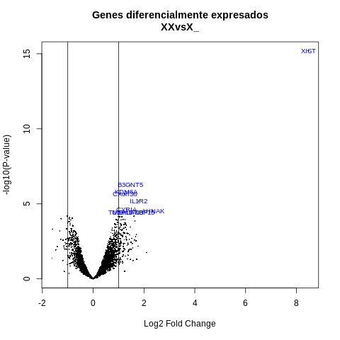
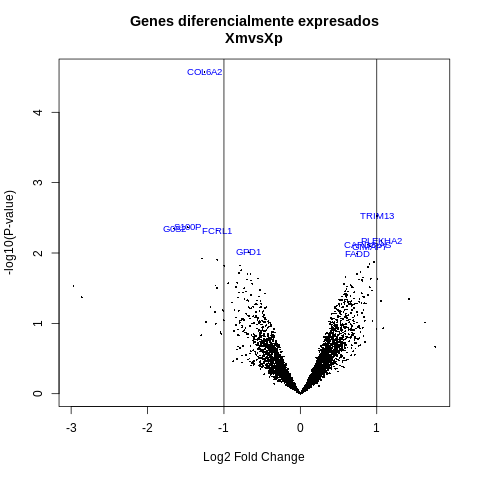

Repositorio en github: <https://github.com/ffer200395/Microarrays.git>
```{r setup, include=FALSE}
library(knitr)
knitr::opts_chunk$set(echo = T, eval = FALSE)
```

# Abstract

El síndrome de Turner es un trastorno genético que afecta a mujeres y se caracteriza por la pérdida de uno de sus cromosomas sexuales X. Las pacientes con dicho síndrome presenta una amplia variedad de síntomas entre los que destacan baja estatura, infertilidad y deformidades oseas.

Dependiendo del origen parental del cromosoma X se puede hacer distinción entre las pacientes Xm y Xp en función de si el cromosoma X heredado proviene la madre o del padre. Fenotípicamente las pacientes con síndrome de Turner Xm y Xp difieren en la severidad de los síntomas.

Los mecanismos que dan lugar al síndrome de Turner son complejos y aún no están claros.

# Objetivos

* Identificar genes diferencialmente expresados entre:
  + Mujeres que presentan el síndrome de Turner (X_) y las que no (XX).
  + Mujeres con ST cuyo cromosoma X es heredado de la madre (Xm) y las que heredaron del padre (Xp).
  
* Mostrar los pasos realizados en el análisis y proveer al investigador/a de resultados que le permita realizar una interpretación biológica.

# Materiales y métodos

## Naturaleza de los datos, tipo de experimento, diseño experimental y tipo de microarrays utilizados 

Partimos de unos datos en formato .CEL que son la expresión génica en microarrays de tipo "Affymetrix Human Genome U133 Plus 2.0 Array" de mujeres con y sin síndrome de Turner. El dataset original puede obtenerse en Gene Expresion Omnibus ([GEO](https://www.ncbi.nlm.nih.gov/geo/query/acc.cgi?acc=GSE46687)) con el identificador "GSE46687" descargando los archivos .CEL. 

Tras aplicar una función que selecciona muestras del dataset original obtenemos un dataset balanceado de 18 muestras, 6 por cariotipo (45Xm, 45Xp, 46XX).

Estamos ante un estudio observacional de un factor con 3 niveles que corresponden con el tipo de cariotipo. Por un lado se realiza una comparación X_ vs XX con el fin de estudiar los cambios de expresión a nivel genómico entre mujeres con ST y las que no. Otra comparación que se realiza es Xm vs Xp con el fin de estudiar el impacto fenotipico en el ST dependiendo si el cromosoma X proviene por vía materna o paterna.

## Métodos utilizados en el análisis (Pipeline)

El proceso de análisis de microarrays sigue un flujo de trabajo ordenado que va desde la correcta lectura y control de calidad de los datos a un análisis de la significación biológica de los resultados.

Tras descargar los archivos .CEL se selecciona una muestra aleatoria que contenga individuos pertenecientes a los 3 grupos del experimento. Los archivos .CEL de los individuos que son seleccionados se cargan en el entorno de trabajo usando a función read.affybatch del paquete affy. Estos datos primeros pasan por un control de calidad en crudo que nos permitirá detectar posibles anomalías/errores en las muestras seleccionadas.

Si se observan que los datos presentan suficiente calidad pasamos a normalizarlos. Se normalizan con el fin de reducir la variabilidad entre las muestras que no sea debida a factores biológicos, hacer las muestras comparables entre sí y reducir el ruido de fondo. Una vez son normalizados se les aplica un filtraje no específico que permite eliminar los genes que varían poco entre los grupos o de los cuales no se dispone de anotacion.

Realizamos la anotación de los genes como paso previo a la obtención de las listas de genes diferencialmente expresados (GDEs). Para obtener estas listas se ha optado por el uso de modelos lineales implementado en el paquete [limma](https://bioconductor.org/packages/release/bioc/html/limma.html), por lo que hemos definido una matriz de diseño que modela el experimento y una matriz de contraste que nos permitirá hacer comparaciones entre los parámetros del modelo estimado. 

Haciendo uso de las funciones constrasts.fit y eBayes del paquete limma se calcula el log fold-change y los p-valores correspondientes para cada gen en cada uno de los constrastes planteados. Con la función topTable se obtiene un data.frame con información sobre la expresión diferencial de los genes.

Por último, usamos los identificadores de los genes que muestran una expresión diferencial estadísticamente significativa y la función hyperGTest del paquete GOstats para obtener resultados de búsqueda relacionados con la función biológica de los conjuntos de genes encontrados o las rutas metabólicas en las que están implicados.

## Descripción cualitativa de cada paso

### Carga de los datos

- Objetivo: Crear un objeto del tipo AffyBatch con el que poder comenzar el análisis de los datos.

- Input: Para cear un objeto AffyBatch partimos de un conjunto de **archivos .CEL** y un archivo **targetsAll.csv** que usaremos para la selección de muestras y dar a estas un nombre más intuitivo.

- Output: Objeto AffyBatch llamado **rawData** sobre el que empezaremos a trabajar.

### Control de calidad de los datos en crudo

- Objetivo: Determinar si los datos de las muestra datos es de suficiente para su posterior normalización o si es necesario eliminar alguna para mejorar la calidad del experimento.

- Input: Objeto AffyBatch **rawData** generado anteriormente.

- Output: Boxplot **boxplot_qcRaw.png**, histograma **hist_qcRaw.png** y salida de la función qc() **qc_statsRaw.png**.

### Normalización

- Objetivo: Corregir diferencias sistemáticas entre las muestras y transformar los datos de forma que estos sean comparables entre sí.

- Input: Objeto AffyBatch **rawData**.

- Output: Objeto ExpressionSet **processedData** obtenido al aplicar la función rma() del paquete affy (almacenado en **normalized.Data.csv**).

### Filtraje no específico

- Objetivo: Eliminar ruido de fondo mediante la eliminación de genes que no muestran una variación significativa en su señal.

- Input: Objeto ExpressionSet **processedData** obtenido en el paso previo.

- Output: Objeto ExpresionSet **pro_filt_data** obtenido tras aplicar la función nsFilter() del paquete genefilter (almacenado en **normalized.Filtered.Data.csv**).

### Selección y anotación de genes diferencialmente expresados

- Objetivo: Determinar que genes son los que se están expresando de manera diferencial de estadísiticamente significativa.

- Input: Objeto ExpresionSet **pro_filt_data** con los datos normalizados y filtrados.

- Output: Dos data.frame **topTab_XmvsXp** y **topTab_XXvsX_** que contienen las listas de genes anotados con mayor diferencia en su expresión correspondientes a los dos contrastes que hemos realizado. Además los volcano plots han sido almacenados en los archivos **volcPlot_XXX_.png** y **volcPlot_XmXp.png**.

### Análisis de la significación biológica (“Gene Enrichment Analysis”)

- Objetivo: Establecer si un proceso biológico o ruta metabólica aparece con mayor o menor frecuencia en la lista de genes seleccionados respecto al conjunto total de genes desde donde se ha obtenido.

- Input: Las topTable obtenidas en el apartado anterior, **topTab_XmvsXp** y **topTab_XXvsX_**.

- Output: Archivos .html del anális de enriquecimiento (prefijos GO y KEGG).


# Resultados del análisis

Tras la carga de los datos y la selección de las muestras realizamos un análisis exploratorio y un control de calidad de los datos en crudo.

Disponemos de las siguientes muestras, en la columna "karyotype" puede verse el grupo al que pertenece cada una:

<center></center>

Antes de aplicar el preprocesamiento de los datos comprobamos si estos son comparables haciendo uso de descriptores globales de los niveles de expresión (boxplot y histograma).

<center></center>

<center></center>

La función qc del paquete affy nos devuelve el siguiente resumen gráfico del análisis de la calidad:

<center></center>

Cada fila del gráfico pertenece a una muestra. El primer porcentaje es conocido como porcentaje de deteccion (% de sondas detectadas con fluorescencia) se espera que este valor sea similar entre las muestras como en nuestro caso. El segundo corresponde a las posiciones del microarray que muestra fluorescenia y donde no se encuentra ninguna sonda de nucleótidos suele representarse como posible problema (en rojo) ya que toma valores muy distintos entre las muestras.

Una vez hemos normalizado los datos y filtrado los genes nos quedamos con un total de **5.040** genes sobre los que aplicar el análisis. Anotamos los genes y comenzamos con el diseño experimental y la creación del modelo lineal, para el que se genera la matriz de diseño y contrastes:

<center></center>

<center></center>

Tras aplicar los contrastes obtenemos las topTable de cada comparación.

Imagen de la cabecera TopTable para la comparación XX vs X_:

<center></center>

Imagen de la cabecera TopTable para la comparación Xm vs Xp:

<center></center>

Cada fila es un gen del microarray y en las columnas tenemos el nombre por el que se conoce cada gen y los resultados de los test de comparación aplicados. Una forma de visualizar gráficamente los genes diferencialmente expresados en función del fold change y la significancia estadística es a través de los volcano plots.

<center></center>

<center></center>

Para la primera comparación que comprendía mujeres con y sin ST se obtuvieron [resultados para los procesos biológicos (GO)](https://github.com/ffer200395/Microarrays/blob/main/results/GOResultsXXvsX_.html) en los que los genes diferencialmente expresados están participan así como para la [ruta matabólica](https://github.com/ffer200395/Microarrays/blob/main/results/KEGGResultsXXvsX_.html). 

En cambio, para la segunda comparación (entre las mujeres que ya padecen ST) sólo se obtuvieron [resultados de GO](https://github.com/ffer200395/Microarrays/blob/main/results/GOResultsXmvsXp.html), estos mucho más acotados que en la primera comparación y donde se aprecia que estos genes están relacionados con la molécula **glicerol 3-fosfato**, la cual posee numerosas funciones en el metabolismo ya que sirve como metabolito para la gluconeogénesis, la biosíntesis de triacilgliceroles y la biosíntesis de diacilglicerol (DAG).

# Apéndice

Código R comentado:

```{r imports}
# Instalación de paquetes requeridos
if (!(require(stringr))) install.packages("stringr")
if (!(require(tm))) install.packages("tm")
if (!(require(gridExtra))) install.packages("gridExtra")
if (!(require(BiocManager))) install.packages("BiocManager")

if (!require(affy))BiocManager::install("affy")
if (!require(affycoretools))BiocManager::install("affycoretools")
if (!require(genefilter))BiocManager::install("genefilter")
if (!require(GOstats))BiocManager::install("GOstats")
if (!(require(hgu133plus2.db)))BiocManager::install("hgu133plus2.db")
if (!require(Biobase))BiocManager::install("Biobase")
if (!require(simpleaffy))BiocManager::install("simpleaffy")
if (!require(affyPLM))BiocManager::install("affyPLM")
```

```{r load}
library(Biobase)
library(affy)
library(tm)

# Directorios
workingDir <- getwd()
rawDataDir <- file.path(workingDir, "raw_data")
resultsDir <- file.path(workingDir, "results")

# Función para elegir muestras aleatoriamente
selectSamples<- function (myID){
 set.seed(myID)
 selected <- c(sample(1:10, 6),11, sample(12:26, 5), sample(27:36,6))
 selected <- sort(selected)
}

# Seleccionamos las muestras y almacenamos el nombre de los archivos .CEL
mySelected <- selectSamples(49044820)# Número aleatorio
targetsAll <- read.csv(file="targetsAll.csv", row.names = 1, head=TRUE)
myTargets <- targetsAll[mySelected,]
fileNames <- row.names(myTargets)

# Obtenemos el nombre completo de los archivos .CEL
all_files <- list.files("raw_data/", pattern = "*.CEL.gz", full.names = FALSE) # Todos
selectFiles <- c() # Los que se necesitan
for(i in 1:length(all_files)){
  fullName = all_files[i]
  name = unlist(strsplit(fullName,"_"))[1] 
  if(is.element(name,fileNames)){ # Si el nombre está en nuestro listado entonces lo añadimos
    selectFiles <- c(selectFiles,fullName)
  }
}

# Modificamos la columna karyotype para que no contenga números
myTargets$karyotype <- removeNumbers(myTargets$karyotype)

# Por último leemos los archivos .CEL que nos interesa y creamos un objeto de tipo AffyBatch
rawData <- read.affybatch(filenames = file.path(rawDataDir,selectFiles),phenoData=AnnotatedDataFrame(myTargets))

# Para tener unos nombres más intuitivos
myTargets$title -> colnames(exprs(rawData))

# Para obtener la tabla de los grupos
library(gridExtra)
png(file=paste0(resultsDir,'/grupos.png'))
grid.table(myTargets)
```

```{r qcRaw}
library(simpleaffy)
library(affyPLM)

png(file=paste0(resultsDir,'/boxplot_qcRaw.png'))
# Diagrama de cajas para obtener una idea de las distribución de las intensidades de las distintas muestras
boxplot(rawData, cex.axis=0.8, las=2, col=c(rep("red", 6), rep("blue", 6), rep("green", 6)),main="Distribución de los valores de intensidad en crudo")

png(file=paste0(resultsDir,'/hist_qcRaw.png'))
# Histograma para conocer si las distribuciones de los distintos arrays son similares
hist(rawData, main="Distribución de las señales")

# Hacemos Anális de Componentes Principales (PCA)
PCA_s <- prcomp(t(exprs(rawData)))
png(file=paste0(resultsDir,'/pca_qcRaw.png'))
plot(PCA_s$x[, 1:2],pch=18, col="blue",main="PCA sobre los datos en crudo")
text(PCA_s$x[, 1:2], row.names(PCA_s$x), cex=0.7, pos=4, offset = 0,col="red")

# Control de calidad en crudo
qualityAnalysisRaw <- qc(rawData)
png(file=paste0(resultsDir,'/qc_statsRaw.png'))
plot(qualityAnalysisRaw)
```

```{r norm}
# Normalización
processedData <- affy::rma(rawData)

# Para tener unos nombres más intuitivos
colnames(processedData) <- myTargets$title

# Guardar
write.csv(exprs(processedData), file=paste0(resultsDir,'/normalized.Data.csv'))
```

```{r filtro}
library(genefilter)
library(hgu133plus2.db)

# La anotación que utiliza el tipo de microarray con el que trabajamos
annotation(processedData) <- "hgu133plus2.db"

# A los datos procesados le aplicamos el filtro 
filtered <- nsFilter(processedData, require.entrez = TRUE, remove.dupEntrez = TRUE, var.filter=TRUE, var.func=IQR, var.cutoff=0.75, filterByQuantile=TRUE, feature.exclude = "^AFFX")

# Almacenamos los datos filtrados en una nueva variable
pro_filt_data <-filtered$eset

# Guardar
write.csv(exprs(pro_filt_data), file=paste0(resultsDir,'/normalized.Filtered.Data.csv'))

# Cuantos genes quedan
dim(pro_filt_data@assayData$exprs)[1]
```

```{r gde}
library(limma)
library(stringr)
library(affycoretools)

# Matriz de diseño, 1 Factor de 3 niveles: XX, Xm, Xp
grupo <- as.factor(myTargets$karyotype)
designMatrix <- model.matrix(~0 + grupo)
colnames(designMatrix) <- str_replace_all(colnames(designMatrix), "grupo","")

# Contrastar Xm vs Xp y Xm+Xp vs XX
# Ver las diferencias entre las pacientes con TS
# Ver las diferencias entre las pacientes con TS y las pacientes sanas
contMatrix <- makeContrasts(XmvsXp = Xm - Xp, XXvsX_ = XX - ((Xp+Xm)/2),levels=designMatrix)
contMatrix

# Anotamos los genes para después obtener las topTable anotadas
pro_filt_data_ann <- annotateEset(pro_filt_data, hgu133plus2.db)

# Creamos el modelo lineal 
fit<-lmFit(pro_filt_data_ann, designMatrix)
fit.main<-contrasts.fit(fit, contMatrix)
fit.main<-eBayes(fit.main)
class(fit.main)

# Ahora toca obtener las listas de GDEs
topTab_XmvsXp <- topTable (fit.main, number=nrow(fit.main), coef="XmvsXp", adjust="fdr") 
topTab_XXvsX_ <- topTable (fit.main, number=nrow(fit.main), coef="XXvsX_", adjust="fdr")
head(topTab_XmvsXp)
head(topTab_XXvsX_)

# Mostramos los volcano plots de ambos contrastes
geneSymbols <- select(hgu133plus2.db, rownames(fit.main), c("SYMBOL"))
SYMBOLS<- geneSymbols$SYMBOL
png(file=paste0(resultsDir,'/volcPlot_XmXp.png'))
volcanoplot(fit.main, coef=1, highlight=10, names=SYMBOLS, main=paste("Genes diferencialmente expresados", colnames(contMatrix)[1], sep="\n"))
abline(v=c(-1,1))
png(file=paste0(resultsDir,'/volcPlot_XXX_.png'))
volcanoplot(fit.main, coef=2, highlight=10, names=SYMBOLS, main=paste("Genes diferencialmente expresados", colnames(contMatrix)[2], sep="\n"))
abline(v=c(-1,1))

# Save
png(file=paste0(resultsDir,'/designMatrix.png'),width = 400, height = 400)
grid.table(designMatrix)
png(file=paste0(resultsDir,'/contMatrix.png'),width = 160, height = 160)
grid.table(contMatrix)
png(file=paste0(resultsDir,'/topTable_XmvsXp.png'),width = 1000, height = 200)
grid.table(head(topTab_XmvsXp,5))
png(file=paste0(resultsDir,'/topTable_XXvsX_.png'),width = 1100, height = 200)
grid.table(head(topTab_XXvsX_,5))
write.csv(topTab_XmvsXp, file=paste0(resultsDir,'/topTable_XmvsXp.csv'))
write.csv(topTab_XXvsX_, file=paste0(resultsDir,'/topTable_XXvsX_.csv'))
```

```{r signicacion}
library(GOstats)

# Que tabla vamos a usar
topTab = topTab_XXvsX_ #topTab_XXvsX_ #topTab_XmvsXp
comparison = 'XXvsX_' #'XXvsX_' #'XmvsXp'

# Almacenamos todo el conjunto de genes y los genes más diferenciados según un umbral del p-valor
entrezUni = unique(topTab$ENTREZID)
whichgenes = topTab["P.Value"]<0.01
geneIds = unique(topTab$ENTREZID[whichgenes])

# Definimos los hyper parámetros para realizar las búsquedas
paramsGO <- new("GOHyperGParams", geneIds =geneIds, universeGeneIds = entrezUni, annotation = "hgu133plus2.db", ontology = "BP", testDirection = "over", pvalueCutoff=0.01) 
paramsKEGG <- new("KEGGHyperGParams", geneIds = geneIds, universeGeneIds = entrezUni, annotation = "hgu133plus2.db",pvalueCutoff = 0.01, testDirection = "over")

# Instanciamos ambos tests
hypGO <- hyperGTest(paramsGO)
hypKEGG <- hyperGTest(paramsKEGG)

# Almacenamos el resultado en html
htmlReport(hypGO, file=paste0(resultsDir,'/GOResults',comparison,'.html'))
htmlReport(hypKEGG, file=paste0(resultsDir,'/KEGGResults',comparison,'.html'))

```
